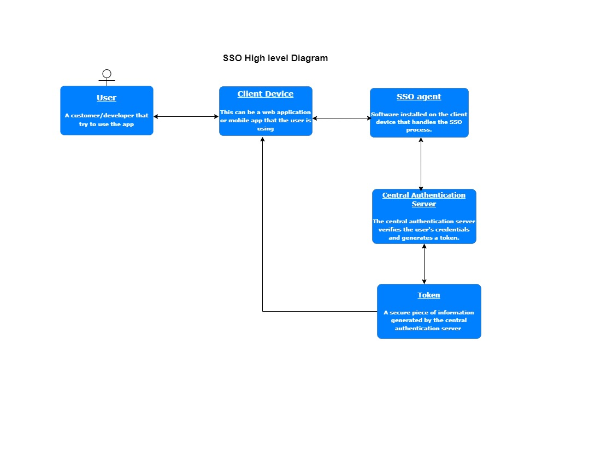
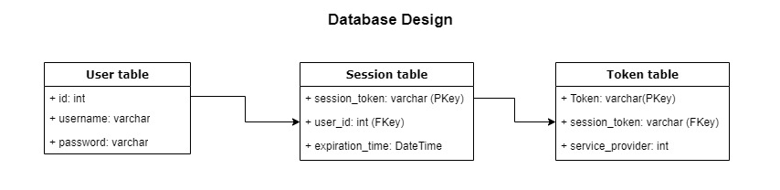

#
# Introduction

Single Sign-On (SSO) is a network architecture that allows users to authenticate with a single set of credentials to access multiple applications or services. The SSO architecture typically includes a central authentication server that holds the user's credentials and an SSO agent installed on the client device or the application server to handle the SSO process. When a user tries to access a protected resource, the SSO agent redirects the user to the central authentication server for authentication. Once the user is authenticated, the central authentication server generates a token, which is passed back to the SSO agent and used to grant access to the protected resource. SSO can improve user productivity and security by eliminating the need for users to remember multiple sets of credentials and reducing the number of login prompts they encounter.

Below are the steps on how to implement the SSO similar to [https://www.okta.com/](https://www.okta.com/)

1. Choose a SSO protocol: Choose a widely supported and well-documented SSO protocol, such as SAML, OpenID Connect, or OAuth2.

1. Implement the SSO server: The SSO server is responsible for authenticating the user and issuing tokens. You can use an open-source library or framework to implement the SSO server, or you can build your own from scratch. For example, you can use the OpenID Connect framework or Auth0 to implement the SSO server.

1. Create a developer portal: This is where customers can create an account, register their applications, and get the necessary credentials to use the SSO service. The developer portal should also provide documentation and tutorials to help customers integrate the SSO service into their applications. You can use a content management system (CMS) such as WordPress to build the developer portal.

1. Provide SDKs and plugins: To make it easy for customers to integrate the SSO service into their applications, you can provide SDKs and plugins for various programming languages and frameworks. For example, you can provide SDKs for Node.js, Python, Java, and Ruby to make it easy for customers to integrate the SSO service into their applications.

1. Implement the client-side integration: Customers will need to integrate the SSO service into their applications. You can provide them with sample code and documentation to help them with the integration process.
2. Implement the server-side integration: The server-side integration will be responsible for validating the token and handling the authorization process. You can provide sample code and documentation to help customers with the server-side integration.

1. Monitor and maintain: Once the SSO service is live, monitor the system for errors and security issues, and make updates as necessary. Keep the documentation and developer portal up-to-date.

1. Test the system: Test the SSO system to make sure it is working as expected. You can use automated testing tools to test the system.

1. Deploy the system: Once the SSO system is tested, deploy it to a production environment.

# Diagram of the different systems.

A single sign-on (SSO) network design diagram typically includes the following components:

**User** : The individual who is trying to access a protected resource.

**Client Device:** The device the user is using to access the protected resource.

**SSO Agent** : Software installed on the client device or the application server that handles the SSO process.

**Central Authentication Server** : A server that holds the user's credentials and is responsible for authenticating the user.

**Protected Resource** : An application or service that requires authentication before access is granted.

**Token** : A secure piece of information generated by the central authentication server that is used to grant access to the protected resource.

The process typically works as follows:

1. The user attempts to access a protected resource.
2. The SSO agent intercepts the request and redirects the user to the central authentication server for authentication.
3. The central authentication server verifies the user's credentials and generates a token.
4. The token is passed back to the SSO agent.
5. The SSO agent uses the token to grant the user access to the protected resource.

**The diagram could be represented as follows:**

**SSO DESIGN Diagram**

# UML/Database design highlighting the key components

A Single Sign-On (SSO) UML typically includes the following components:

**User:** The individual who is trying to access a protected resource.

**Credentials:** User's login credentials such as username and password.

**Session:** A record of an authenticated user's session, including the session token, expiration time, and any other relevant information.

**Identity Provider (IdP**): A server that holds the user's credentials and is responsible for authenticating the user.

**Service Provider (SP):** The protected resource that requires authentication before access is granted.

**Token:** A secure piece of information generated by the Identity Provider that is used to grant access to the protected resource.

The UML class diagram could be represented as follows:

**User**

    -username

    -password

**Credentials**

    -username

    -password

**Session**

    -session\_token

    -expiration\_time

**IdentityProvider**

    -authenticate(username, password)

    -generateToken(session)

**ServiceProvider**

    -authenticate(token)

    -accessGranted(session)

**The database design could be represented as follows:**

# Approach to OOP and designing loosely-couped systems

My approach to Object-Oriented Programming (OOP) is based on the principles of encapsulation, inheritance, and polymorphism.

**Encapsulation:** Encapsulation is the process of hiding the internal details of an object from the outside world and providing a consistent interface for interacting with the object. This allows for greater control over the object's behavior and makes the code more maintainable.

**Inheritance:** Inheritance allows for the creation of new classes that inherit the properties and methods of existing classes. This promotes code reuse and makes it easier to create new classes that are similar to existing ones.

**Polymorphism:** Polymorphism allows objects of different classes to be treated as objects of a common superclass. This allows for more flexible and dynamic code that can adapt to different situations.

To design loosely-coupled systems,

I follow these principles of SOLID object-oriented design principles:

**Dependency Inversion Principle:** High-level modules should not depend on low-level modules, but rather both should depend on abstractions.

**Single Responsibility Principle:** Each class should have a single responsibility, and that responsibility should be entirely encapsulated by the class.

**Open-Closed Principle:** Classes should be open for extension, but closed for modification.

**Liskov Substitution Principle:** Derived classes should be substitutable for their base classes.

**Interface Segregation Principle:** A class should not be forced to implement interfaces it does not use.

By following these principles, I can design systems that are more flexible, maintainable, and adaptable to changing requirements.

# Create a deployment plan

A single sign-on (SSO) deployment plan typically includes the following steps:

**Requirements gathering and analysis:** Identify the SSO requirements for your organization and assess the current state of your infrastructure. This includes determining which applications and services will be included in the SSO implementation, as well as identifying any potential challenges or limitations.

**Solution selection:** Research and evaluate different SSO solutions and select one that best meets your organization's requirements.

**Solution design** : Design the SSO solution, including the architecture and infrastructure, taking into consideration factors such as scalability, security, and performance.

**Solution testing:** Test the SSO solution in a non-production environment to ensure that it meets your organization's requirements and that it is free of errors or bugs.

**Deployment:** Deploy the SSO solution in the production environment. This includes installing the necessary components, configuring the SSO solution, and integrating it with your organization's existing infrastructure.

**User training:** Provide training to users on how to use the SSO solution, including how to log in, how to access protected resources, and how to troubleshoot any issues that may arise.

**Monitoring and maintenance** : Monitor the SSO solution and perform regular maintenance to ensure that it continues to meet your organization's requirements and that it remains secure and reliable.

# Securing the SSO

Some of the security measures will be as

1. Encryption

2. Two-factor authentication

3. Regular security audits

4. Keep the softwares and plugins up to date

# How can this system scale

There are several ways to scale and they include:

**Load Balancing** : Distribute user requests across multiple servers to prevent any single server from becoming overwhelmed.

**Caching:** Use caching to store frequently accessed information in memory, reducing the number of requests to the SSO server.

**Database Replication** : Replicate the SSO database to multiple servers to spread the load and increase availability.

**Cloud-based SSO:** Use a cloud-based SSO service that can automatically scale based on demand.

# Setting up an agile team to build this product.

**Define the product backlog:** Create a product backlog that outlines the features, user stories, and requirements for the product. This will serve as the foundation for the team's work.

**Assemble the team:** Identify the roles and skills needed for the team and assemble a cross-functional team with the necessary skills and experience. The team should include a product owner, a Scrum master, and developers, designers, and QA specialists.

**Establish team norms and processes** : Establish team norms and processes, such as daily stand-up meetings, sprint planning, and retrospectives, to ensure that the team is working efficiently and effectively.

**Implement agile tools:** Implement agile tools such as Jira, Trello or Asana to manage tasks and track progress. This will allow the team to easily track progress, identify roadblocks, and make adjustments as needed.

**Hold regular sprint planning:** Hold regular sprint planning sessions to review the product backlog, prioritize tasks, and plan the next sprint. This will ensure that the team is always working on the most important tasks.

**Hold daily stand-up meetings:** Hold daily stand-up meetings to ensure that everyone is on the same page and to identify and resolve any issues that arise.

**Hold regular retrospectives:** Hold regular retrospectives to gather feedback and identify opportunities for improvement in the team's processes and performance.

**Encourage collaboration and communication:** Encourage collaboration and communication among team members to ensure that everyone is working together towards a common goal.

**Continuously improve:** Regularly assess and improve team processes and performance to ensure that the team is operating at its best. This can be done through regular retrospectives, or using agile metrics such as velocity or team satisfaction.

Written By Raphael Ikediashi

For the engineer manager role
